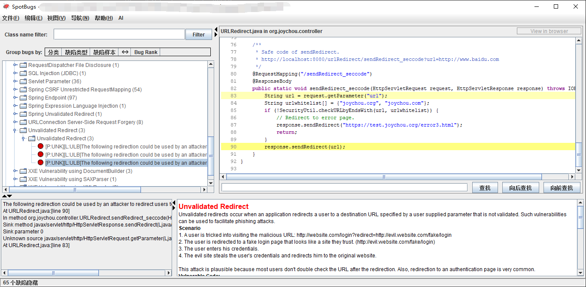
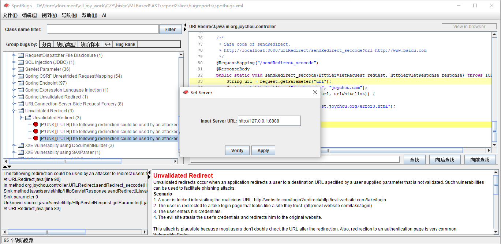
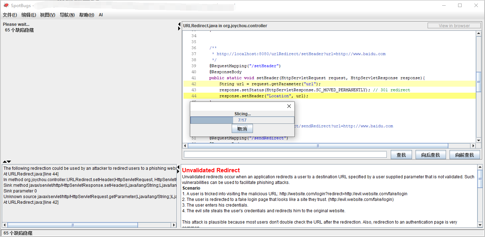
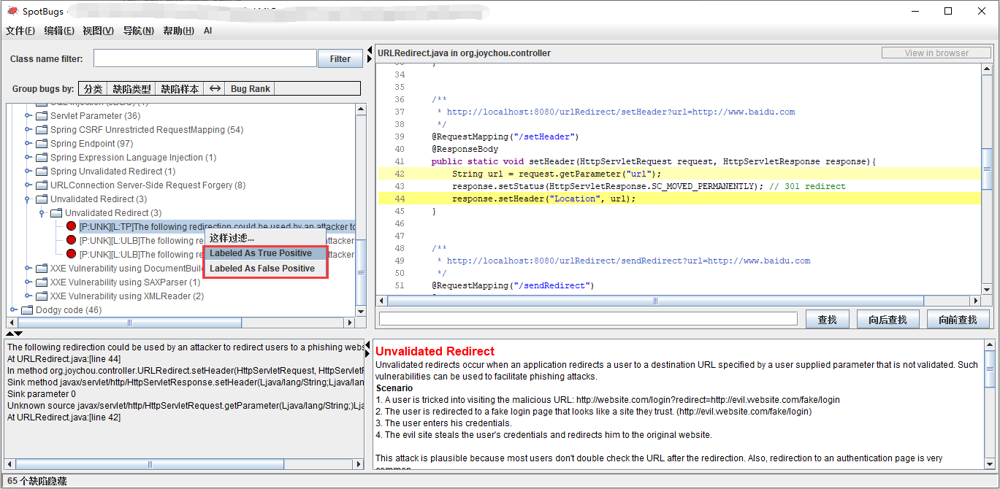

# ML-based-SAST

**ML-based-SAST** 是一个使用程序切片和BLSTM降低污点传播SAST误报率的工具demo。

# Project Structure

```plain
.
├── README.md
├── ml # 机器学习模块
│   ├── _theano # BLSTM theano实现版本
│   ├── api.py # API Server
│   ├── console.py # CLI
│   ├── data -> ../report2slice/kb/ # 学习用的知识库
│   ├── model # BLSTM model
│   ├── preprocessing.py # 数据预处理，包括tokenize
│   ├── settings.py
│   ├── tests # Test case
│   ├── tf # BLSTM tensorflow实现版本
│   └── utils # 用于转换格式
└── report2slice # 切词模块
    ├── kb # 学习用的知识库
    │   ├── label
    │   └── slice
    ├── ml-based-sast-slice # 核心切词模块
    ├── ml-based-sast-spotbugsGUI # 改造版spotbugsGUI
    └── pom.xml
```

# Build

1. ML-based-SAST 依赖Joana，因此第一步是使用如下命令构建joana：

    ```bash
    # Fetch sources
    git clone https://github.com/Anemone95/joana
    cd joana
    git submodule init
git submodule update
    
    # Joana depends on WALA, build WALA first
    cd contrib/wala
    mvn verify -DskipTests=true -e
cd ../..
    
    # Build Joana and upload to Maven local repository
    ant -f mvn-build.xml
    ```

2. 构建切片模块

   ```bash
   # Fetch sources
   git clone https://github.com/Anemone95/MLBasedSAST
   cd MLBasedSAST/report2slice
   mvn clean package
   ```

3. 安装学习模块环境，学习模块依赖如下库

    ```plain
    tensorflow==2.0.0
    requests==2.22.0
    flask==1.1.1
    theano==1.0.4
    fire==0.2.1
    ```

# Usage

## API.py——启动服务器

启动一个服务器用来预测，接受slice和label，以及启动一个训练

```bash
cd MLBasedSAST/ml
python api.py --model-npz=xxx.npz # run api server
```

## Spotbugs GUI

```bash
java -jar xxx.jar
```

启动后可以看到一个修改版的Spotbugs GUI，首先新建/打开一个project，获取分析结果，该步骤与原版操作过程相同：



### 设置服务器

点击"AI->Set Server"，设置用于预测的服务器:



### 切片并获取预测结果

点击"AI->Slice and Predict"，程序会首先分析污点传播结果，对相关Bug进行切片：



切片完成后，程序发送给服务器获取预测结果，可以在左侧看到预测结果。

### 清空数据

如果在分析过程中中断，再次slice时会从失败前的最有一步开始，若想重新开始则可以点击“AI->Clean”清除先前数据。

### 标记数据

不论是否进行预测，都可以对一个漏洞实例进行标记，右键漏洞实例即可，标记结果会同时发送给服务器，作为将来学习使用



## console.py——学习控制台

## 启动一次学习

```bash
cd ml
python console.py train --slice-dir=data/slice/benchmark1.2 --label-dir=data/label/benchmark1.2 --epochs=20 # 切片数据文件夹，标记数据文件夹，最大迭代次数
```

