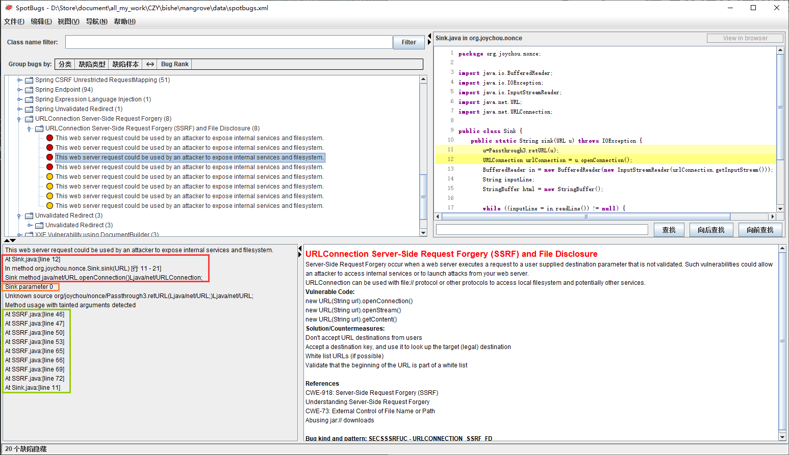

# Spotbugs污点分析的结果解析

前四行记录sink点（存在caller和callee的概念）

后面记录污点传播记录，但是如果存在**多个污点入口**时，其只能按文件行号和调用顺序显示污点，需要手动分析，但不论如何第一行肯定是程序入口点

每个节点只有开始结束行号，没有方法名

# 过滤Filter

可以反射出继承com.h3xstream.findsecbugs.injection.BasicInjectionDetector的所有类，然后获取他们

的TYPE

# WarningtoSliceOWASP
org.owasp.benchmark.testcode.BenchmarkTest00336,64,,label,doPost(Ljavax/servlet/http/HttpServletRequest;Ljavax/servlet/http/HttpServletResponse;)V:org.owasp.benchmark.testcode.BenchmarkTest00336,5 2 3 4 5 6 7 8 9 10 11
分析
sink类，sink行号，jar包路径，label，入口函数签名，入口类，suffix

